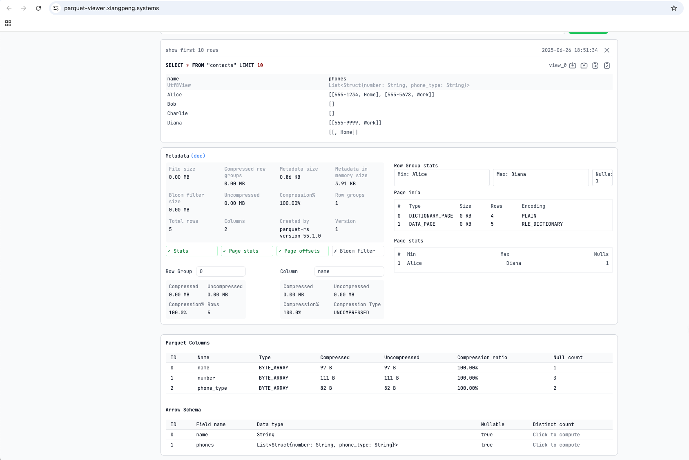

## Parquet Nested Data

This experiment demonstrates how to serialize nested Rust data structures into a __Parquet__ file using the __Apache
Arrow__ memory format as an intermediate representation.

It demonstrates the Record Shredding API for storing nested objects like `Contact` in a columnar format like Parquet.

```rust
struct Contact {
    name: Option<String>,
    phones: Option<Vec<Phone>>,
}

struct Phone {
    number: Option<String>,
    phone_type: Option<PhoneType>,
}

enum PhoneType {
    Home,
    Work,
}
```

### How to Run

From the root of the monorepo, you can run this experiment using its package name. The `RUST_LOG` variable is used to
control the log output.

```zsh
RUST_LOG=info cargo run -p parquet-nested-data
```

To check the code for formatting, linting, and other issues, you can use the verification script:

```zsh
./scripts/verify.sh parquet-nested-data
```

### Expected Output

Running the experiment will create a `contacts.parquet` file in root directory of this repository.

```text
[timestamp INFO  parquet_nested_data] Created 5 contacts.
...
[timestamp INFO  parquet_nested_data] Created parquet here: contacts.parquet
[timestamp INFO  parquet_nested_data] Fin.
```

The structure of the generated `contacts.parquet` file can be inspected with this wonderful online
Parquet viewer: [https://parquet-viewer.xiangpeng.systems/](https://parquet-viewer.xiangpeng.systems/). The nested data
will be represented as follows:



### DuckDB SQL

Another way to consume and analyze this file is to query it directly. An engine like __DuckDB__ can flatten the nested
phones list on the fly, as shown in this example:

```text
D select name, unnest(phones, recursive := true) from read_parquet('contacts.parquet');
┌─────────┬──────────┬────────────┐
│  name   │  number  │ phone_type │
│ varchar │ varchar  │  varchar   │
├─────────┼──────────┼────────────┤
│ Alice   │ 555-1234 │ Home       │
│ Alice   │ 555-5678 │ Work       │
│ Diana   │ 555-9999 │ Work       │
│ NULL    │ NULL     │ Home       │
└─────────┴──────────┴────────────┘
```

_(Note: The query and output above were generated with the following DuckDB version)_

```text
D
.
version
DuckDB v1.3.0-dev3259 e0e4cc2cc8
clang-17.0.0
```
